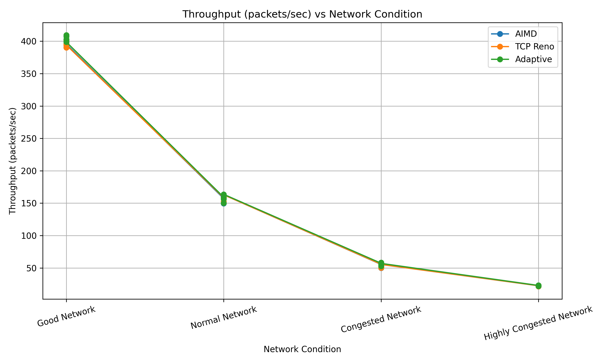
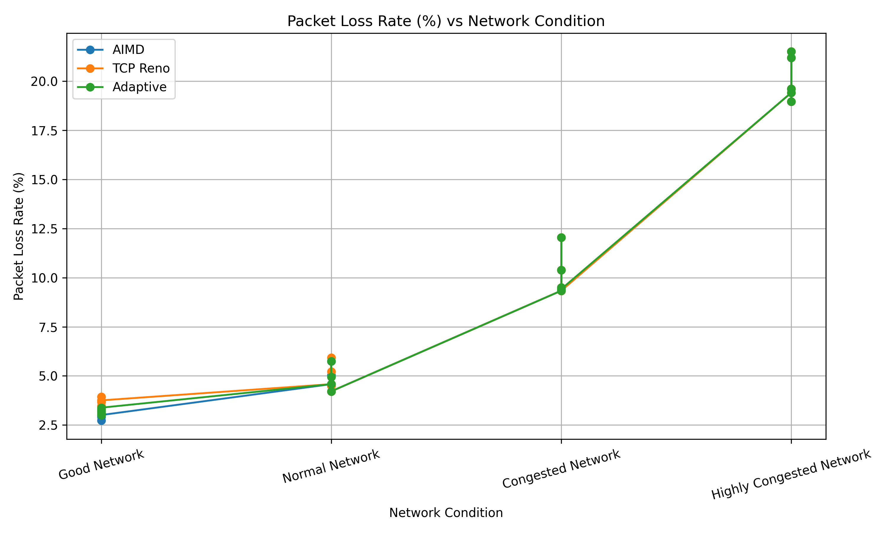
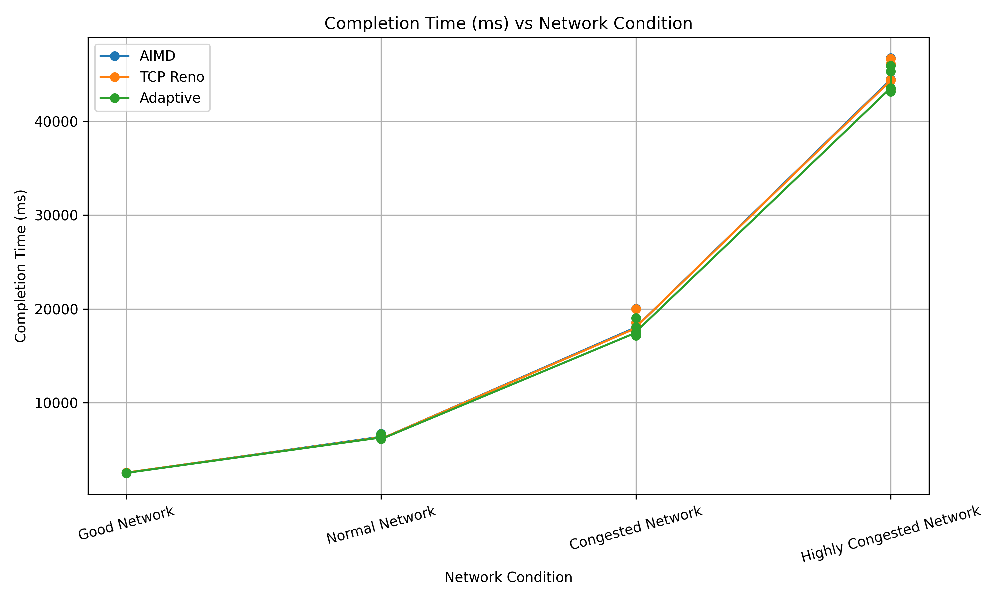
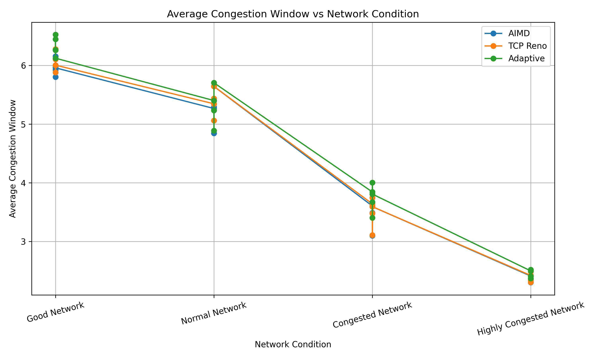

# Adaptive Network Congestion Control Optimizer

## Design and Performance Evaluation of an Adaptive Network Congestion Control Optimizer

A research-oriented network simulation project that studies adaptive congestion control under different network conditions.

The project implements and compares three congestion-control approaches:

* **AIMD (Additive Increase Multiplicative Decrease)**
* **TCP Reno-inspired Congestion Control**
* **Adaptive Congestion Controller**

The Adaptive Controller uses packet loss, network delay, recent transmission outcomes, and queue utilization to dynamically select an appropriate congestion-control strategy.

---

## 1. Research Problem

Network congestion occurs when the amount of traffic entering a network exceeds the available network capacity.

Traditional congestion-control algorithms use predefined rules to modify the congestion window. Although these approaches work effectively in many situations, their behavior may not be optimal across changing network conditions.

This project investigates whether an adaptive congestion controller can improve network performance by dynamically adjusting its transmission behavior according to observed network conditions.

---

## 2. Objectives

The main objectives of this project are:

1. Design an adaptive congestion-control mechanism.
2. Simulate packet transmission under different network conditions.
3. Compare Adaptive control with AIMD and TCP Reno-inspired control.
4. Measure throughput, packet loss, completion time, and congestion-window behavior.
5. Evaluate the algorithms over repeated experiments.
6. Study the trade-off between aggressive transmission and congestion avoidance.

---

## 3. System Architecture

```text
                  +------------------+
                  |      Sender      |
                  +--------+---------+
                           |
                           | Packets
                           v
                  +------------------+
                  |      Router      |
                  |                  |
                  | Loss Simulation  |
                  | Delay Simulation |
                  | Queue Model      |
                  +--------+---------+
                           |
                           | Delivered Packets
                           v
                  +------------------+
                  |     Receiver     |
                  +--------+---------+
                           |
                           | ACK
                           v
                  +------------------+
                  | Congestion       |
                  | Controller       |
                  +--------+---------+
                           |
              +------------+------------+
              |            |            |
              v            v            v
            AIMD       TCP Reno      Adaptive
```

---

## 4. Congestion-Control Algorithms

### AIMD

AIMD increases the congestion window when transmission succeeds and reduces the window when packet loss occurs.

```text
Successful transmission → Increase CWND
Packet loss              → Reduce CWND
```

---

### TCP Reno

The project includes a simplified TCP Reno-inspired congestion controller.

It implements:

* Slow Start
* Congestion Avoidance
* Multiplicative decrease after packet loss

The implementation is intended for comparative simulation and is not a complete implementation of the TCP Reno protocol.

---

### Adaptive Controller

The proposed Adaptive Controller dynamically selects one of three strategies:

```text
              Network Feedback
                     |
          +----------+----------+
          |          |          |
          v          v          v
      Aggressive   Balanced  Conservative
```

The controller considers:

* Recent packet-loss rate
* Network loss rate
* Observed delay
* Queue utilization
* Current congestion-window behavior

A sliding window containing recent transmission outcomes is used to estimate recent packet-loss behavior.

---

## 5. Adaptive Strategy

### Aggressive

Used when network conditions are stable.

Characteristics:

* Faster congestion-window growth
* Smaller reduction after packet loss
* Attempts to utilize available network capacity

### Balanced

Used under moderate network conditions.

Characteristics:

* Moderate congestion-window growth
* Moderate reduction after congestion
* Balances utilization and stability

### Conservative

Used when congestion indicators become significant.

Characteristics:

* Reduced transmission aggressiveness
* Stronger congestion-window reduction
* Attempts to prevent excessive congestion

---

## 6. Experimental Setup

Each algorithm was evaluated using **1000 packets per experiment**.

Each network condition was repeated **5 times**.

### Network Conditions

| Condition                | Packet Loss |      Bandwidth | Delay |
| ------------------------ | ----------: | -------------: | ----: |
| Good Network             |          1% | 1000 packets/s |  5 ms |
| Normal Network           |          5% |  500 packets/s | 15 ms |
| Congested Network        |         10% |  200 packets/s | 30 ms |
| Highly Congested Network |         20% |  100 packets/s | 50 ms |

The same experimental seed sequence was used across algorithms to support comparison.

---

## 7. Evaluation Metrics

### Throughput

Number of successfully delivered packets per second.

**Higher is better.**

### Packet Loss Rate

Percentage of transmission attempts that result in packet loss.

**Lower is better.**

### Completion Time

Time required to successfully deliver the complete packet set.

**Lower is better.**

### Average Congestion Window

Average number of packets transmitted within the congestion window during the simulation.

This provides an indication of the transmission aggressiveness of each controller.

---

## 8. Experimental Results

### Average Throughput

| Network Condition |   AIMD |   TCP Reno |   Adaptive |
| ----------------- | -----: | ---------: | ---------: |
| Good              | 395.38 |     395.04 | **404.14** |
| Normal            | 157.05 | **158.23** |     157.72 |
| Congested         |  54.26 |      54.31 |  **56.12** |
| Highly Congested  |  22.22 |      22.23 |  **22.59** |

Adaptive achieved the highest throughput in **three of the four network conditions**.

The largest improvement over AIMD occurred under the Congested Network condition, where Adaptive achieved approximately **3.43% higher throughput**.

### Average Completion Time

| Network Condition |       AIMD |      TCP Reno |       Adaptive |
| ----------------- | ---------: | ------------: | -------------: |
| Good              |  2529.4 ms |     2531.6 ms |  **2474.6 ms** |
| Normal            |  6372.2 ms | **6322.8 ms** |      6345.4 ms |
| Congested         | 18465.4 ms |    18447.6 ms | **17841.4 ms** |
| Highly Congested  | 45029.4 ms |    45018.8 ms | **44298.6 ms** |

Adaptive achieved lower completion time than AIMD in the Good, Congested, and Highly Congested conditions.

### Average Packet Loss Rate

| Network Condition |  AIMD | TCP Reno | Adaptive |
| ----------------- | ----: | -------: | -------: |
| Good              |  3.0% |     3.7% |     3.2% |
| Normal            |  4.8% |     4.9% |     4.8% |
| Congested         | 10.1% |    10.1% |    10.1% |
| Highly Congested  | 20.1% |    20.1% |    20.1% |

The Adaptive controller maintained packet-loss rates broadly comparable with the baseline algorithms.

---

## 9. Research Graphs

### Throughput



### Packet Loss



### Completion Time



### Congestion Window



---

## 10. Key Findings

* Adaptive achieved the highest throughput in **Good, Congested, and Highly Congested** conditions.
* The largest throughput improvement over AIMD was approximately **3.43%** in the Congested Network.
* Adaptive achieved lower completion time under Good, Congested, and Highly Congested conditions.
* Packet-loss behavior remained broadly comparable across the three approaches.
* TCP Reno achieved slightly higher throughput than Adaptive under the Normal Network condition.
* Adaptive reduced its average congestion window as network conditions became more congested.
* The results show that adaptive control can remain competitive across different network conditions.

---

## 11. Project Structure

```text
NetworkCongestionOptimizer/
│
├── Main.java
├── Packet.java
├── Acknowledgement.java
├── Receiver.java
├── Router.java
├── Sender.java
│
├── CongestionController.java
├── AIMDController.java
├── RenoController.java
├── AdaptiveController.java
├── AdaptiveOptimizer.java
│
├── NetworkCondition.java
├── TransmissionResult.java
├── SimulationResult.java
├── SimulationRunner.java
├── ExperimentRunner.java
│
├── experiment_results.csv
│
├── throughput.png
├── packet_loss.png
├── completion_time.png
├── congestion_window.png
│
└── .gitignore
```

---

## 12. Technologies Used

* Java
* Object-Oriented Programming
* Computer Networks
* Congestion Control
* Network Simulation
* Algorithms
* Performance Evaluation
* Python
* Pandas
* Matplotlib
* Git
* GitHub

---

## 13. How to Run

### Compile

```bash
javac *.java
```

### Run

```bash
java Main
```

The experiment executes the configured network conditions and produces the experimental results.

The generated data is stored in:

```text
experiment_results.csv
```

---

## 14. Experimental Data

The repository contains the experimental results in:

```text
experiment_results.csv
```

The dataset contains results for:

* 3 congestion-control algorithms
* 4 network conditions
* 5 repetitions per condition

---

## 15. Limitations

This project is a controlled simulation rather than a complete implementation of a real TCP/IP network stack.

The current model uses a simplified batch-based router and queue model. It does not reproduce all mechanisms of real TCP implementations, including:

* Packet-level RTT estimation
* Retransmission timers
* Duplicate ACK processing
* Fast Retransmit
* Fast Recovery
* Complete TCP state-machine behavior
* Full discrete-event network simulation

The TCP Reno implementation is a simplified Reno-inspired model intended for controlled algorithm comparison.

These limitations should be considered when interpreting the experimental results.

---

## 16. Future Work

Future versions can extend the simulator by:

1. Implementing a discrete-event network simulation model.
2. Adding realistic RTT and ACK timing.
3. Implementing duplicate ACK detection.
4. Adding TCP Fast Retransmit and Fast Recovery.
5. Testing larger packet workloads.
6. Evaluating additional congestion-control algorithms.
7. Introducing dynamically changing network conditions.
8. Performing larger-scale statistical evaluation.
9. Investigating reinforcement-learning-based congestion control.
10. Comparing the approach using real network traces or established network simulators.

---

## 17. Research Contribution

The primary contribution of this project is the design and evaluation of a feedback-driven adaptive congestion controller that dynamically changes its transmission strategy according to observed network conditions.

Instead of using a single fixed congestion-control behavior, the proposed approach combines recent packet-loss observations, delay measurements, and queue utilization to select an appropriate congestion-control strategy.

The experimental evaluation demonstrates that the adaptive approach can remain competitive with conventional approaches across multiple network conditions while maintaining comparable packet-loss behavior.

---

## 18. Author

**Ganna Vishnu Sai**

M.Tech / Computer Science and Engineering

---

## License

This project is intended for academic and research purposes.
